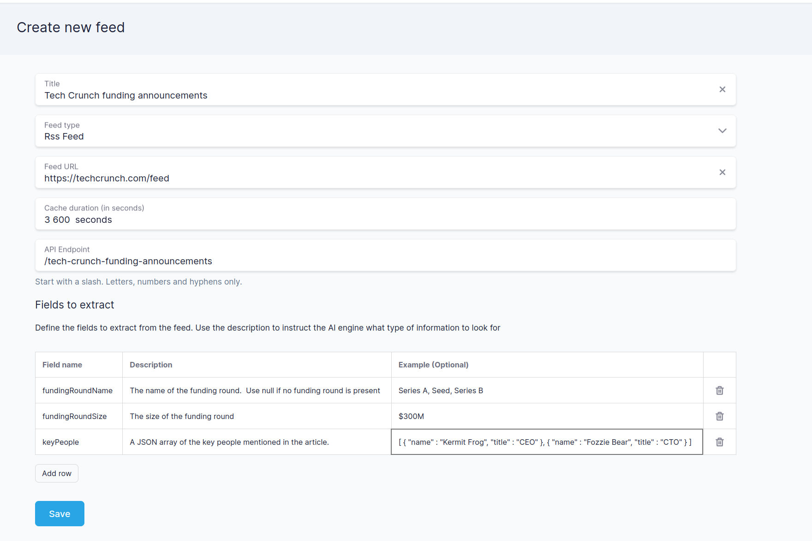
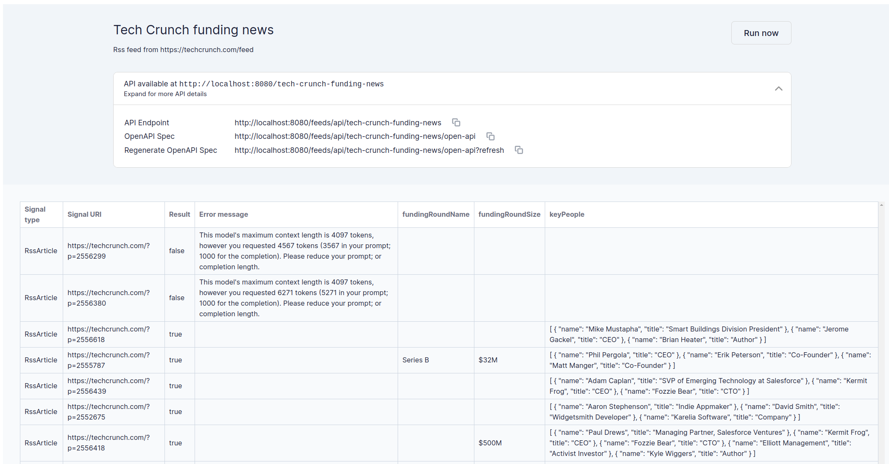

# Signal Hound
Provides a series of APIs and tools for using sources on the internet (eg., RSS feeds) to
find triggers that might be useful indicators someone is a fit for our ICP.

It's the backbone of our outbound lead gen process for [Orbital](https://orbitalhq.com)

Over time, the plan is to build on this to automate as much of our outbound lead gen as possible.

It's designed as a series (ok, one for now) of tools / APIs that we orchestrate together to build
a lead gen funnel.

Orchestration is provided by our own product - Orbital.

## RSS to Insight API
Give the platform an RSS feed, and design an API of insights (signals) you want to look for.

Turns the RSS feed into a well structured REST API, along with an OpenAPI spec.

eg:  Scan TechCrunch for news about ESG Startups closing funding rounds.  You can be as specific about the fields
of information you'd like.  The more descriptive, the better.

Here's an example of a feed looking at tech crunch for companies announcing funding rounds, and determining if their
business model suggests they'll need to consume / aggregate multiple data feeds:

| Field name                         | Description                                                                                                                              | Example                                                                                     |
|------------------------------------|------------------------------------------------------------------------------------------------------------------------------------------|---------------------------------------------------------------------------------------------|
| companyName                        | The name of the company                                                                                                                  | Acme Incorporated                                                                           |
| url                                | The website of the company                                                                                                               | https://acme.com                                                                            |
| companyDescription                 | A short summary of what the company does.  Max 250 chars                                                                                 | Acme is a fictional company that creates things used to blow up a road runner               |
| articleDescribesFundingRound       | Boolean (true/false) indicating if this article describes a funding round                                                                | true                                                                                        |
| fundingRoundName                   | The name of the funding round.  Use null if no funding round is present                                                                  | Series A, Seed, Series B                                                                    |
| fundingRoundSize                   | The size of the funding round                                                                                                            | $300M                                                                                       |
| keyPeople                          | A JSON array of the key people mentioned in the article.                                                                                 | [ { "name" : "Joe Rogan", "title" : "CEO" }, { "name" : "Josh Manpoor", "title" : "CTO" } ] |
| requiresConsumingExternalDataFeeds | Boolean (true/false) indicating if the article suggests the company's mission would require them to consume multiple external data feeds | true                                                                                        |
| justificationForExternalDataFeeds  | A description summarizing why you believe the company does or does not require consuming external data feeds                             | Acme is an aggregator of external financial data                                            |

Some screenshots:

### Define an RSS Feed

### Explore the feed in the UI

### Exposed APIs
Once the feed is designed, it's available on an API.  An OpenAPI spec is also generated for your API.

Data is cached based on the period you define, so you don't spam the OpenAI API.

We also generate an OpenAPI spec.  (This is needed for Orbital to orchestrate the APIs together).

## Can I use this?
Yep.  It's licensed under ELv2, so you can use it for your own purposes, modify it, run it locally, etc -- you just can't use it to build your own managed service.

The intent of choosing this license is to allow others who are running their own startup to self-host this tool for building their own sales funnel automations.
But, if I choose to launch this as a product someday, then I don't want you competing with me.  

See the `LICENSE` file for full details.

Currently, this repo is hacked together to automate our lead-gen functionality.  It's not designed with being public-facing,
so there may be security issues.  Use at your own risk.

## Building
The app is built on:
 * Kotlin / Spring Boot
 * Angular